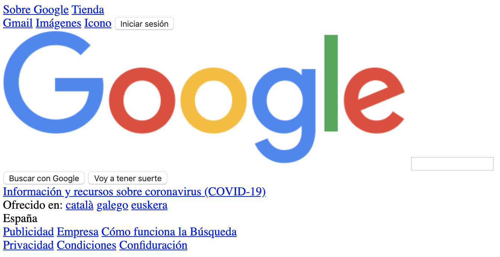

# Bootcamp Web - Ejercicio 1

Ya hemos aprendido los conceptos básicos de HTML y CSS. Seguramente nos 
preguntamos qué podemos construir con estos conocimiento.

Una página web que todos utilizamos a diario es Google, y una de las mejores maneras de aprender
es replicando página ya existentes, así que vamos a clonar la página web de Google.

El código básico para que puedas comenzar ya está creado, al igual que las imágenes necesarias.

## Cómo comenzar

- Clona el repositorio
- En el directorio raíz tendrás los archivos `index.html` y `styles.css` que son los que 
tendrás que modificar.
- Utiliza selectores `class` para dar estilo a tus objetos.
- Añade los estilos en el fichero `style.css`
- Utiliza las imágenes que hay en el directorio `img` para el logo y los iconos necesarios.

**IMPORTANTE:** recuerda que para aprender a programar tendrás que practicar, buscar en internet 
y probar diferentes formas de hacer las cosas. Por lo tanto no debes mirar la solucion hasta haber
pasado al menos **3 horas** realizando el ejercicio. Lo ideal es que no lo mires hasta que hayas acabado.
De esta manera aprenderás de los errores y las dificultades.

## Resultado esperado

## Primero, sin aplicar CSS tendremos algo así

